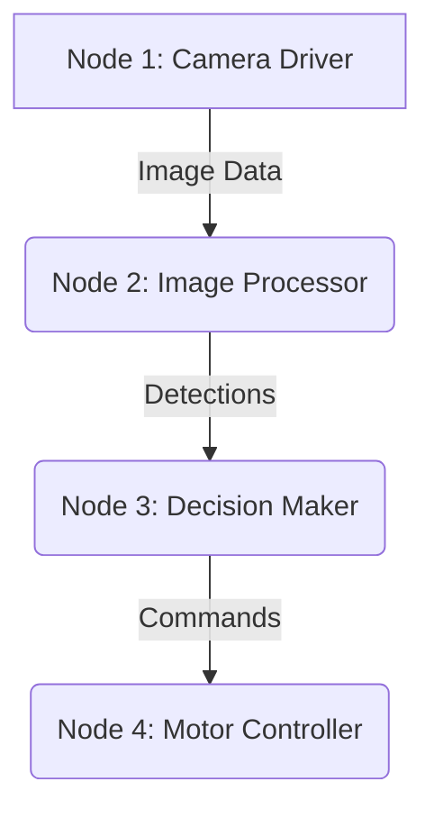

import Prerequisites from '@site/src/components/Prerequisites';
import LearningObjective from '@site/src/components/LearningObjective';
import Outcome from '@site/src/components/Outcome';
import SuccessCriteria from '@site/src/components/SuccessCriteria';
import Exercise from '@site/src/components/Exercise';
import Checkpoint from '@site/src/components/Checkpoint';

# Chapter 1: ROS 2 Basics

This chapter will cover the basics of the Robot Operating System (ROS 2), including nodes, topics, services, and actions.

<Prerequisites>
  
Before you begin, you should have a basic understanding of programming concepts and be familiar with the Linux command line.

</Prerequisites>

<LearningObjective>
  <ul>
    <li>Understand the core components of a ROS 2 system.</li>
    <li>Explain the role of nodes, topics, services, and actions.</li>
    <li>Be able to run and inspect a simple ROS 2 system.</li>
  </ul>
</LearningObjective>

## The ROS 2 Graph

At its core, a ROS 2 system is a graph of processes (called **nodes**) that communicate with each other. This graph structure allows for modular and scalable robotics applications.

### Nodes

A **node** is the smallest unit of execution in ROS 2. Each node should be responsible for a single, well-defined task, such as controlling a wheel, reading a sensor, or planning a path.

### Topics

**Topics** are named buses over which nodes exchange messages. They use a publish-subscribe communication pattern. A node can **publish** messages to a topic, and any number of other nodes can **subscribe** to that topic to receive the messages. This is a one-to-many communication mechanism.

### Services

**Services** are used for request-response communication. A node can offer a **service**, and another node can act as a **client** to send a request and wait for a response. This is a one-to-one communication mechanism, suitable for tasks that require a direct confirmation, like "get the robot's current position."

### Actions

**Actions** are used for long-running tasks that provide feedback. They are similar to services but are designed for tasks that might take a significant amount of time to complete, such as navigating to a goal. An action client can send a goal to an action server, receive feedback on the progress of the goal, and get a final result.

<Checkpoint>
  
What is the main difference between a ROS 2 topic and a service?

</Checkpoint>

<Exercise>
  
Follow the official ROS 2 documentation to install ROS 2 and run the "turtlesim" simulator. Use the `ros2` command-line tools to move the turtle around by publishing to the `/turtle1/cmd_vel` topic.

</Exercise>

<Outcome>
  
You should now have a foundational understanding of the key communication mechanisms in ROS 2. You can use this knowledge to start building your own robotics applications.

</Outcome>

<SuccessCriteria>
  <ul>
    <li>Successfully run a ROS 2 talker and listener.</li>
    <li>Use the `ros2` command-line tool to inspect topics and services.</li>
    <li>Draw a diagram illustrating the difference between topics and services.</li>
  </ul>
</SuccessCriteria>
