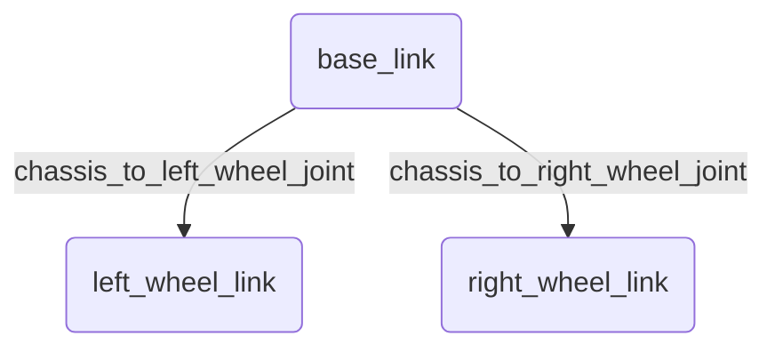

import Prerequisites from '@site/src/components/Prerequisites';
import LearningObjective from '@site/src/components/LearningObjective';
import Outcome from '@site/src/components/Outcome';
import SuccessCriteria from '@site/src/components/SuccessCriteria';
import Exercise from '@site/src/components/Exercise';
import Checkpoint from '@site/src/components/Checkpoint';

# Chapter 2: Robot Modeling

This chapter will cover the fundamentals of robot modeling using URDF and SDF.

<Prerequisites>
  
You should have a basic understanding of ROS 2 concepts, particularly nodes and topics.

</Prerequisites>

<LearningObjective>
  <ul>
    <li>Understand the purpose of a robot description format.</li>
    <li>Learn the basic syntax of URDF and SDF.</li>
    <li>Be able to create a simple robot model.</li>
  </ul>
</LearningObjective>

## Why Do We Need Robot Models?

Before we can simulate or control a robot, we need a way to describe its physical properties to the software. A robot model defines the robot's structure, including its links, joints, sensors, and visual appearance.

## URDF (Unified Robot Description Format)

**URDF** is an XML-based format used in ROS to describe the kinematics and dynamics of a robot. It represents the robot as a tree of **links** connected by **joints**.

-   **Links:** These are the rigid parts of the robot (e.g., the chassis, a wheel, an arm segment).
-   **Joints:** These define the motion between links. Common joint types include `revolute` (for rotating joints), `continuous` (for wheels), and `prismatic` (for sliding joints).

## SDF (Simulation Description Format)

**SDF** is another XML-based format, primarily used by the Gazebo simulator. While URDF is great for describing the kinematics of a single robot, SDF is a more comprehensive format that can describe an entire simulation world, including multiple robots, lighting, physics, and sensors.

<Checkpoint>
  
When would you choose to use SDF over URDF?

</Checkpoint>

<Exercise>
  
Create a simple URDF file for a robot with a single arm that rotates at the shoulder. Use the `check_urdf` tool to verify your file, and then visualize it in RViz2.

</Exercise>

<Outcome>
  
You can now create basic representations of robots for use in ROS and Gazebo.

</Outcome>

<SuccessCriteria>
  <ul>
    <li>Create a URDF file for a simple two-wheeled robot.</li>
    <li>Explain the difference between a link and a joint.</li>
    <li>Load and visualize a URDF model in RViz2.</li>
  </ul>
</SuccessCriteria>
