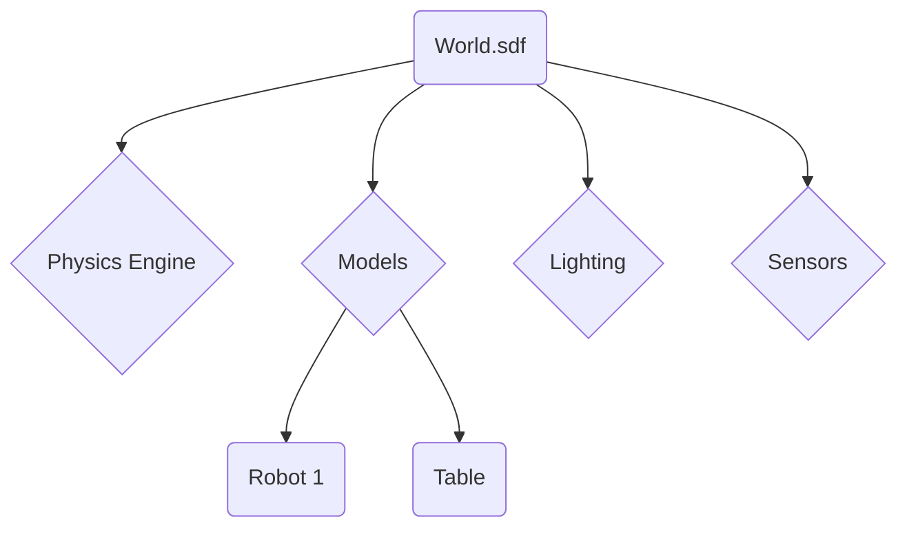

import Prerequisites from '@site/src/components/Prerequisites';
import LearningObjective from '@site/src/components/LearningObjective';
import Outcome from '@site/src/components/Outcome';
import SuccessCriteria from '@site/src/components/SuccessCriteria';
import Exercise from '@site/src/components/Exercise';
import Checkpoint from '@site/src/components/Checkpoint';

# Chapter 3: Gazebo Simulation Fundamentals

This chapter will introduce the Gazebo simulation environment and its fundamental concepts.

<Prerequisites>
  
You should be familiar with robot modeling concepts (URDF/SDF) and have a basic understanding of ROS 2.

</Prerequisites>

<LearningObjective>
  <ul>
    <li>Understand the role of a simulator in robotics development.</li>
    <li>Learn the basic components of the Gazebo interface.</li>
    <li>Be able to spawn a robot model in a Gazebo world.</li>
  </ul>
</LearningObjective>

## Why Simulation is Essential

Developing and testing on physical robots can be slow, expensive, and risky. A simulator like Gazebo provides a virtual environment where you can safely and rapidly test your robot's software. Gazebo simulates physics, sensors, and actuators, allowing you to develop your code as if it were running on a real robot.

## The Gazebo World

A Gazebo simulation takes place in a **world**, which is defined in an SDF file. The world file specifies the environment, including:

-   **Models:** Robots, furniture, and other objects.
-   **Physics:** Gravity, friction, and other physical properties.
-   **Lighting:** Light sources to illuminate the scene.
-   **Sensors:** Simulated cameras, LiDAR, IMUs, etc.

## Interfacing with ROS 2

Gazebo integrates seamlessly with ROS 2 through a set of plugins. These plugins expose the simulator's functionality through standard ROS 2 topics, services, and actions. For example, you can control a simulated robot's joints by publishing messages to a ROS 2 topic, and you can receive simulated sensor data from another topic.

<Checkpoint>
  
What is a "world" file in Gazebo, and what does it typically define?

</Checkpoint>

<Exercise>
  
Launch an empty Gazebo world. Use the Gazebo GUI to add simple shapes (like a box and a sphere) to the world. Apply different materials and colors to them.

</Exercise>

<Outcome>
  
You are now able to create and interact with a basic simulation environment in Gazebo, and you understand how it connects to ROS 2.

</Outcome>

<SuccessCriteria>
  <ul>
    <li>Launch Gazebo with a pre-built world.</li>
    <li>Spawn a URDF or SDF model into the simulation.</li>
    <li>Interact with the simulation using the Gazebo GUI.</li>
  </ul>
</SuccessCriteria>
