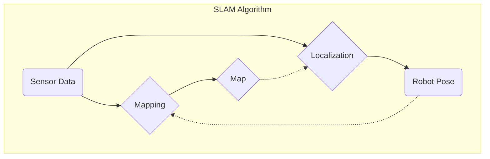

import Prerequisites from '@site/src/components/Prerequisites';
import LearningObjective from '@site/src/components/LearningObjective';
import Outcome from '@site/src/components/Outcome';
import SuccessCriteria from '@site/src/components/SuccessCriteria';
import Exercise from '@site/src/components/Exercise';
import Checkpoint from '@site/src/components/Checkpoint';

# Chapter 5: Introduction to Navigation Concepts

This chapter will provide an introduction to robot navigation concepts, including SLAM and path planning with Nav2.

<Prerequisites>
  
You should be able to control a simulated robot in Gazebo and have a good understanding of ROS 2 fundamentals.

</Prerequisites>

<LearningObjective>
  <ul>
    <li>Understand the three main components of robot navigation: mapping, localization, and path planning.</li>
    <li>Learn what SLAM is and why it's important.</li>
    <li>Be introduced to the Nav2 stack in ROS 2.</li>
  </ul>
</LearningObjective>

## The Challenge of Navigation

For a robot to move from point A to point B autonomously, it needs to answer three questions:

1.  **Mapping:** "What does the world look like?"
2.  **Localization:** "Where am I in the world?"
3.  **Path Planning:** "How do I get to my destination?"

## SLAM (Simultaneous Localization and Mapping)

In many real-world scenarios, a robot starts in an unknown environment. It doesn't have a map, and it doesn't know its location. **SLAM** is a set of algorithms that allows a robot to build a map of its environment while simultaneously tracking its own position within that map. This is a classic "chicken and egg" problem in robotics, and it is fundamental to autonomous navigation.

## The Nav2 Stack

**Nav2** is the official navigation stack in ROS 2. It is a powerful and flexible system that provides a complete solution for autonomous navigation. Nav2 takes in sensor data, a map, and a goal, and it outputs velocity commands to move the robot to the goal while avoiding obstacles.

Key components of Nav2 include:

-   **Costmaps:** Representations of the environment where each cell has a value corresponding to its "cost" to travel through. Obstacles have a high cost.
-   **Planners:** Algorithms that find a path from the robot's current position to the goal.
-   **Controllers:** Algorithms that follow the planned path while reacting to immediate obstacles.

<Checkpoint>
  
Why is SLAM considered a "chicken and egg" problem?

</Checkpoint>

<Exercise>
  
Explore the Nav2 documentation. Run the Nav2 getting started example and send a navigation goal to the simulated robot in RViz2.

</Exercise>

<Outcome>
  
You now have a conceptual framework for understanding the complex topic of robot navigation. You are ready to dive deeper into the specific algorithms and tools used to make robots navigate autonomously.

</Outcome>

<SuccessCriteria>
  <ul>
    <li>Explain the difference between localization and mapping.</li>
    <li>Describe the inputs and outputs of a SLAM algorithm.</li>
    <li>List the main components of the Nav2 stack.</li>
  </ul>
</SuccessCriteria>
