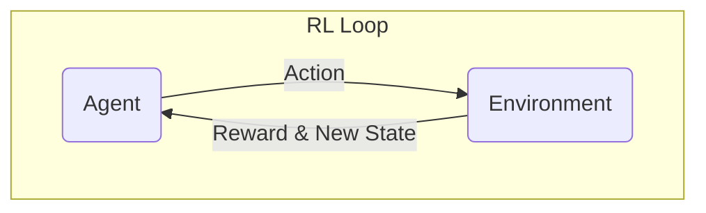

import Prerequisites from '@site/src/components/Prerequisites';
import LearningObjective from '@site/src/components/LearningObjective';
import Outcome from '@site/src/components/Outcome';
import SuccessCriteria from '@site/src/components/SuccessCriteria';
import Exercise from '@site/src/components/Exercise';
import Checkpoint from '@site/src/components/Checkpoint';

# Chapter 1: Reinforcement Learning for Robotics

This chapter introduces the application of reinforcement learning (RL) in robotics.

<Prerequisites>
  
You should have a basic understanding of Python programming and machine learning concepts.

</Prerequisites>

<LearningObjective>
  <ul>
    <li>Understand the basic concepts of Reinforcement Learning: agent, environment, state, action, and reward.</li>
    <li>Learn the difference between model-based and model-free RL.</li>
    <li>Be introduced to Q-Learning and Deep Q-Networks (DQN).</li>
  </ul>
</LearningObjective>

## The Reinforcement Learning Framework

**Reinforcement Learning (RL)** is a paradigm of machine learning where an **agent** learns to make decisions by interacting with an **environment**. The agent takes **actions** in the environment, and the environment returns a **reward** and the next **state**. The agent's goal is to learn a **policy** (a mapping from states to actions) that maximizes the total reward over time.

## Q-Learning

**Q-Learning** is a classic model-free RL algorithm. It learns a **Q-function**, which represents the "quality" of taking a certain action in a certain state. The Q-function is learned by iteratively updating it based on the rewards received from the environment.

## Deep Q-Networks (DQN)

For problems with a large number of states (like robotics), it's not feasible to store a Q-value for every state-action pair. **Deep Q-Networks (DQN)** solve this problem by using a deep neural network to approximate the Q-function. The neural network takes the state as input and outputs the Q-values for all possible actions.

<Checkpoint>
  
In the context of RL, what is a "policy"?

</Checkpoint>

<Exercise>
  
Use the OpenAI Gym library to train a simple RL agent to solve the "CartPole" problem. Experiment with different hyperparameters (like the learning rate and discount factor) and observe how they affect the agent's performance.

</Exercise>

<Outcome>
  
You now have a foundational understanding of how reinforcement learning can be used to train intelligent agents. You are ready to explore how these techniques can be applied to more complex robotics problems.

</Outcome>

<SuccessCriteria>
  <ul>
    <li>Define the five core components of an RL problem.</li>
    <li>Explain the purpose of a reward function.</li>
    <li>Describe a robotics problem that could be solved using RL.</li>
  </ul>
</SuccessCriteria>
